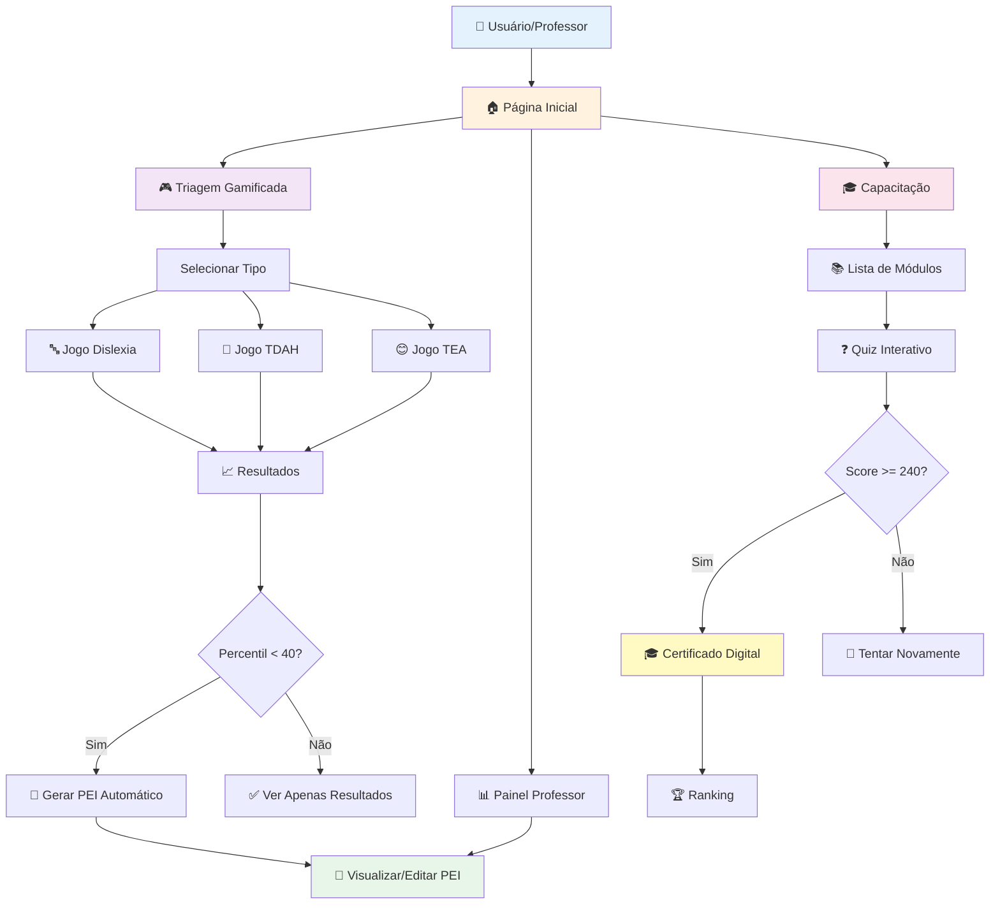

# 🏗️ Arquitetura do Sistema - Neuro Play EDU

## 📐 Diagrama de Fluxo Principal



---

## 🗂️ Estrutura de Dados

### Fluxo de Informações:

```
┌─────────────────────────────────────────────────────────────┐
│                        FRONTEND (React)                      │
├─────────────────────────────────────────────────────────────┤
│                                                              │
│  ┌──────────────┐  ┌──────────────┐  ┌──────────────┐     │
│  │  useScreening │  │    usePEI    │  │useTeacherTr..│     │
│  │     Hook      │  │     Hook     │  │    Hook      │     │
│  └──────────────┘  └──────────────┘  └──────────────┘     │
│         │                 │                  │              │
└─────────┼─────────────────┼──────────────────┼──────────────┘
          │                 │                  │
          ▼                 ▼                  ▼
┌─────────────────────────────────────────────────────────────┐
│                    SUPABASE CLIENT API                       │
├─────────────────────────────────────────────────────────────┤
│  • Authentication (auth.uid())                               │
│  • Real-time subscriptions                                   │
│  • RLS Policy enforcement                                    │
└─────────────────────────────────────────────────────────────┘
          │                 │                  │
          ▼                 ▼                  ▼
┌─────────────────────────────────────────────────────────────┐
│                   DATABASE (PostgreSQL)                      │
├─────────────────────────────────────────────────────────────┤
│                                                              │
│  ┌──────────────┐  ┌──────────────┐  ┌──────────────┐     │
│  │  screenings  │  │  pei_plans   │  │teacher_train.│     │
│  │              │  │              │  │   progress   │     │
│  │ • id         │  │ • id         │  │ • id         │     │
│  │ • user_id    │  │ • user_id    │  │ • user_id    │     │
│  │ • type       │  │ • screening  │  │ • module_id  │     │
│  │ • score      │  │ • objectives │  │ • score      │     │
│  │ • percentile │  │ • activities │  │ • completed  │     │
│  │ • game_data  │  │ • progress   │  │ • answers    │     │
│  └──────────────┘  └──────────────┘  └──────────────┘     │
│                                                              │
└─────────────────────────────────────────────────────────────┘
```

---

## 🔐 Segurança e Permissões (RLS)

### Row Level Security Policies:

```
┌─────────────────────────────────────────────────────────────┐
│                      RLS POLICIES                            │
├─────────────────────────────────────────────────────────────┤
│                                                              │
│  ┌─ screenings ──────────────────────────────────────────┐ │
│  │  SELECT: auth.uid() = user_id                         │ │
│  │  INSERT: auth.uid() = user_id                         │ │
│  │  UPDATE: auth.uid() = user_id                         │ │
│  │  DELETE: ❌ Not allowed                                │ │
│  └───────────────────────────────────────────────────────┘ │
│                                                              │
│  ┌─ pei_plans ───────────────────────────────────────────┐ │
│  │  SELECT: auth.uid() = user_id                         │ │
│  │  INSERT: auth.uid() = user_id                         │ │
│  │  UPDATE: auth.uid() = user_id                         │ │
│  │  DELETE: auth.uid() = user_id                         │ │
│  └───────────────────────────────────────────────────────┘ │
│                                                              │
│  ┌─ teacher_training_progress ───────────────────────────┐ │
│  │  SELECT: auth.uid() = user_id                         │ │
│  │  INSERT: auth.uid() = user_id                         │ │
│  │  UPDATE: auth.uid() = user_id                         │ │
│  │  DELETE: ❌ Not allowed                                │ │
│  └───────────────────────────────────────────────────────┘ │
│                                                              │
└─────────────────────────────────────────────────────────────┘

✅ Usuários só acessam seus próprios dados
✅ Nenhum acesso cruzado entre usuários
✅ Proteção automática no nível do banco
```

---

## 🎯 Fluxo de Triagem Detalhado

```
START
  │
  ├─> [1] Usuário acessa /screening
  │        │
  │        ├─> Verificação de autenticação
  │        │   └─> Se não autenticado → Redirect /auth
  │        │
  │        └─> Mostra opções: Dislexia | TDAH | TEA
  │
  ├─> [2] Usuário seleciona tipo
  │        │
  │        ├─> useScreening.startScreening(type)
  │        │   └─> Salva screening inicial no banco
  │        │
  │        └─> Navega para jogo específico
  │
  ├─> [3] Usuário joga (10-15 min)
  │        │
  │        ├─> Coleta de dados:
  │        │   • Acertos/erros
  │        │   • Tempo de reação
  │        │   • Padrões de resposta
  │        │
  │        └─> Cálculo de score (0-100)
  │
  ├─> [4] Fim do jogo
  │        │
  │        ├─> useScreening.saveScreening(score, duration, gameData)
  │        │   │
  │        │   ├─> Calcula percentil (baseado em população)
  │        │   ├─> Gera recomendação
  │        │   └─> Salva no banco (UPDATE screenings)
  │        │
  │        └─> Verifica percentil
  │
  ├─> [5] Se percentil < 40:
  │        │
  │        ├─> useScreening.generatePEI(screeningId, result)
  │        │   │
  │        │   ├─> Gera objetivos personalizados
  │        │   ├─> Gera atividades recomendadas
  │        │   ├─> Gera recomendações pedagógicas
  │        │   └─> INSERT INTO pei_plans
  │        │
  │        └─> Mostra botão "Ver PEI"
  │
  └─> [6] Navega para /screening-result
           │
           └─> Exibe: Score | Percentil | Recomendação | Link PEI
END
```

---

## 📊 Fluxo de PEI

```
┌─────────────────────────────────────────────────────────────┐
│                    CICLO DE VIDA DO PEI                      │
└─────────────────────────────────────────────────────────────┘

[1] CRIAÇÃO AUTOMÁTICA
    └─> Trigger: Triagem com percentil < 40
        └─> usePEI.createPEI()
            ├─> Objetivos baseados em gaps identificados
            ├─> Atividades sugeridas por IA
            ├─> Recomendações personalizadas
            └─> Status: "active", Progress: 0%

[2] VISUALIZAÇÃO
    └─> Professor acessa /pei/:id
        └─> usePEI.fetchPEIPlans()
            └─> Carrega do banco via RLS

[3] EDIÇÃO
    └─> Professor modifica conteúdo
        ├─> Adiciona/remove objetivos
        ├─> Ajusta atividades
        └─> Atualiza recomendações
        
[4] ACOMPANHAMENTO
    └─> Professor atualiza progresso (0-100%)
        └─> usePEI.updatePEI(planId, { progress })
            └─> UPDATE pei_plans SET progress = X

[5] CONCLUSÃO
    └─> Progress >= 100%
        └─> usePEI.updatePEI(planId, { status: 'completed' })
            └─> Marca como concluído

[6] ARQUIVAMENTO (opcional)
    └─> Professor arquiva PEI antigo
        └─> usePEI.updatePEI(planId, { status: 'archived' })
```

---

## 🎓 Fluxo de Capacitação

```
┌─────────────────────────────────────────────────────────────┐
│              JORNADA DE CAPACITAÇÃO DOCENTE                  │
└─────────────────────────────────────────────────────────────┘

INÍCIO
  │
  ├─> [1] Professor acessa /training
  │        │
  │        └─> useTeacherTraining.fetchProgress()
  │            └─> Carrega módulos completados e scores
  │
  ├─> [2] Escolhe módulo (ex: "Fundamentos da Dislexia")
  │        │
  │        └─> Navega para /training/:moduleId
  │            └─> Carrega 30 questões do trainingModules.ts
  │
  ├─> [3] QUIZ INTERATIVO
  │        │
  │        │   ┌─────────────────────────────────┐
  │        │   │ Para cada questão (30x):        │
  │        │   │                                 │
  │        │   │ [a] Exibe questão + 4 opções    │
  │        │   │       │                         │
  │        │   │       ├─> Usuário responde      │
  │        │   │       │                         │
  │        │   │       ├─> Feedback IMEDIATO:    │
  │        │   │       │   • ✅ Correto (+10pts) │
  │        │   │       │   • ❌ Incorreto (+0pts)│
  │        │   │       │   • 📝 Explicação       │
  │        │   │       │                         │
  │        │   │       └─> Score acumulado       │
  │        │   │                                 │
  │        │   │ [b] Próxima questão             │
  │        │   └─────────────────────────────────┘
  │        │
  │        └─> Total possível: 300 pontos
  │
  ├─> [4] FIM DO QUIZ
  │        │
  │        ├─> useTeacherTraining.saveProgress(moduleId, score, answers)
  │        │   │
  │        │   └─> INSERT/UPDATE teacher_training_progress
  │        │       ├─> completed: false (se score < 240)
  │        │       └─> completed: true (se score >= 240)
  │        │
  │        └─> Verifica score
  │
  ├─> [5] Se score >= 240 (80%):
  │        │
  │        ├─> ✅ APROVADO!
  │        ├─> Gera certificado digital
  │        ├─> UPDATE completed = true
  │        └─> Mostra botão "Baixar Certificado"
  │
  └─> [6] Se score < 240:
           │
           ├─> ⚠️ Não aprovado
           ├─> Mostra score atual
           ├─> completed = false
           └─> Botão "Tentar Novamente"
FIM
```

---

## 🏗️ Componentes React - Hierarquia

```
App.tsx
 │
 ├─> NeuroPlayIndex.tsx (/)
 │    ├─> NeuralHero
 │    ├─> HowItWorksSection
 │    ├─> CognitiveGamesGrid
 │    ├─> AIDiagnosticSection
 │    ├─> InstitutionalSection
 │    └─> Footer
 │
 ├─> ScreeningSelection.tsx (/screening)
 │
 ├─> [Jogos de Triagem]
 │    ├─> DislexiaScreening.tsx (/games/dislexia-screening)
 │    ├─> TDAHScreening.tsx (/games/tdah-screening)
 │    └─> TEAScreening.tsx (/games/tea-screening)
 │
 ├─> ScreeningResult.tsx (/screening-result)
 │
 ├─> PEIView.tsx (/pei/:id)
 │    ├─> Card (Objetivos)
 │    ├─> Card (Atividades)
 │    ├─> Card (Recomendações)
 │    └─> Progress Bar
 │
 ├─> TeacherDashboard.tsx (/teacher-dashboard)
 │    ├─> ModernMetricCard (x4)
 │    ├─> Table (Triagens)
 │    └─> Badge (Status)
 │
 └─> [Capacitação]
      ├─> TeacherTraining.tsx (/training)
      │    ├─> ModernGameCard (x6 módulos)
      │    └─> TeacherRanking
      │
      └─> TrainingModule.tsx (/training/:moduleId)
           ├─> Progress (questões)
           ├─> Question Card
           ├─> Feedback Alert
           └─> Score Display
```

---

## 📈 Métricas e KPIs

### Dashboard do Professor:

```
┌────────────────────────────────────────────────────────┐
│  MÉTRICAS CALCULADAS                                   │
├────────────────────────────────────────────────────────┤
│                                                        │
│  📊 Total de Triagens                                  │
│     └─> COUNT(screenings WHERE user_id = current)     │
│                                                        │
│  ⚠️ Estudantes em Risco                                │
│     └─> COUNT(screenings WHERE percentile < 40)       │
│                                                        │
│  📝 PEIs Ativos                                         │
│     └─> COUNT(pei_plans WHERE status = 'active')      │
│                                                        │
│  🎓 Módulos Completados                                 │
│     └─> COUNT(teacher_training_progress               │
│              WHERE completed = true)                   │
│                                                        │
└────────────────────────────────────────────────────────┘
```

---

## 🔄 Integração entre Sistemas

```
┌─────────────────────────────────────────────────────────────┐
│                  INTEGRAÇÃO DE SISTEMAS                      │
└─────────────────────────────────────────────────────────────┘

TRIAGEM ───────────┐
                   │
                   ├──> [Percentil < 40] ──> PEI AUTOMÁTICO
                   │                            │
                   │                            ├──> Objetivos
                   │                            ├──> Atividades
                   │                            └──> Recomendações
                   │
                   └──> DASHBOARD ──> Métricas agregadas
                                       │
                                       └──> Lista completa
                                            └──> Link para PEI

CAPACITAÇÃO ───────┐
                   │
                   ├──> [Score >= 240] ──> CERTIFICADO
                   │
                   └──> RANKING ──> Comparação entre professores
                                    └──> Gamificação
```

---

## 🎨 Design System

### Cores Semânticas:

```css
/* Primary - Azul */
--primary: Triagem, ações principais

/* Green - Verde */  
--success: PEI, aprovação, progresso

/* Purple - Roxo */
--training: Capacitação docente

/* Red - Vermelho */
--danger: Alertas, risco, erros

/* Yellow - Amarelo */
--warning: Atenção necessária

/* Blue variants */
--blue-500: Dislexia
--green-500: TDAH  
--purple-500: TEA
```

---

## 📱 Responsividade

```
Desktop (>= 1024px)
├─> Layout com sidebar
├─> Cards em grid (3 colunas)
├─> Tabelas completas
└─> Dashboard expandido

Tablet (768px - 1023px)
├─> Layout simplificado
├─> Cards em grid (2 colunas)
├─> Tabelas scrolláveis
└─> Menu colapsável

Mobile (< 768px)
├─> Layout em pilha
├─> Cards em coluna única
├─> Tabelas responsivas
└─> Menu hambúrguer
```

---

## 🚀 Performance

### Otimizações Implementadas:

```
✅ React Query para cache de dados
✅ Lazy loading de componentes
✅ Índices no banco de dados
✅ Debounce em buscas
✅ Memoization de cálculos complexos
✅ Virtual scrolling em listas longas
✅ Code splitting por rota
```

---

**🎉 Sistema completo e documentado!**
